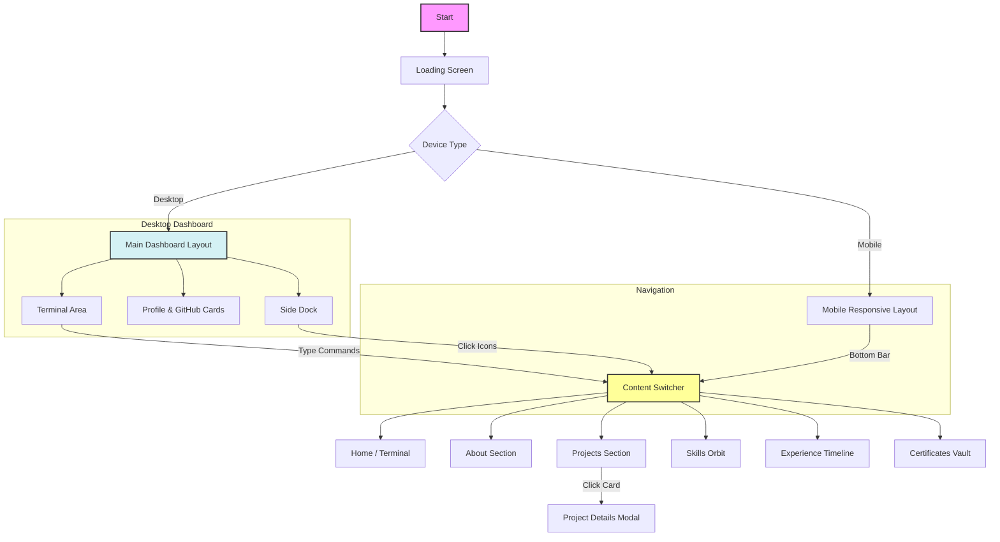

# 🚀 Spandana's Interactive Terminal Portfolio

A futuristic, high-performance developer portfolio merging the aesthetics of a macOS terminal with advanced web technologies. Built with React, TypeScript, and Three.js, this application offers an immersive user experience through interactive command-line interfaces, 3D visualizations, and a sleek, responsive design.


## 🌟 Key Features

### 🖥️ Core Interface
- **Interactive Terminal**: A fully functional command-line interface (CLI) that users can type into to navigate the site, run commands, and uncover "easter eggs".
- **Dynamic Dock**: A macOS-inspired animated dock with magnification effects for intuitive mouse-based navigation.
- **Responsive Layout**: Seamlessly adapts between a complex desktop dashboard and a mobile-friendly view.

### 🎨 Visualizations & Graphics
- **3D Skills Orbit**: Interactive 3D particle system visualizing technical skills using `Three.js`.
- **GitHub Activity Intelligence**: Real-time analysis and visualization of coding activity and contributions.
- **Glassmorphism UI**: Modern, translucent aesthetic with blurred backgrounds and vibrant gradients.

### 📂 Content Modules
- **Project Showcase**: Detailed modals with image carousels and technical deep-dives.
- **Experience Timeline**: A structured view of professional history and career progression.
- **Certificates & Achievements**: "Smart Card" styled secure credential vault display.
- **AI Chatbot Integration**: Integrated "Easy Peasy" AI assistant to answer visitor queries.

## 🛠️ Tech Stack

### Frontend Core
- **Framework**: [React](https://react.dev/) (via [Vite](https://vitejs.dev/))
- **Language**: [TypeScript](https://www.typescriptlang.org/)
- **Styling**: [Tailwind CSS](https://tailwindcss.com/)
- **Animation**: `tailwindcss-animate`, CSS Transitions

### UI & Components
- **Component Library**: [Radix UI](https://www.radix-ui.com/) (Headless accessibility primitives)
- **Icons**: [Lucide React](https://lucide.dev/)
- **3D Graphics**: [Three.js](https://threejs.org/)

### Utilities & State
- **Routing**: [React Router](https://reactrouter.com/)
- **Data Fetching**: [TanStack Query](https://tanstack.com/query/latest)
- **Forms**: React Hook Form + Zod validation
- **Date Handling**: date-fns

## 📦 Installation & Setup

1.  **Clone the repository**
    ```bash
    git clone https://github.com/yourusername/macos-terminal-folio.git
    cd macos-terminal-folio
    ```

2.  **Install Dependencies**
    ```bash
    npm install
    # or
    yarn install
    # or
    bun install
    ```

3.  **Run Development Server**
    ```bash
    npm run dev
    ```
    The application will be available at `http://localhost:5173`.

4.  **Build for Production**
    ```bash
    npm run build
    ```

## 🗺️ Application Flow



## 🤝 Contributing

Contributions are welcome! Please feel free to submit a Pull Request.

## 📄 License

This project is licensed under the MIT License.

